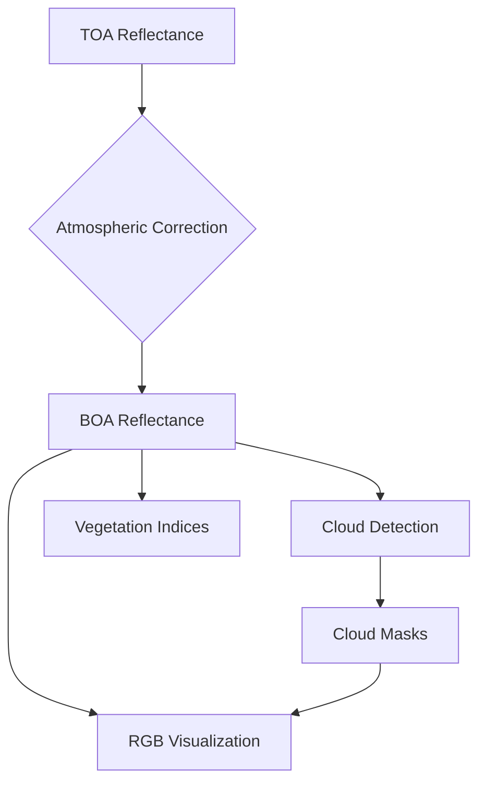

# 🌤️ Atmospheric Correction-First Pipeline for Sentinel-2 L1C Imagery with PNG Visualization

## Objective
Modify the Python pipeline that:
1. **Applies atmospheric correction FIRST**
2. Performs cloud detection on corrected reflectance
3. Generates diagnostic PNG visualizations
4. Produces analysis-ready outputs

## 🔧 System Requirements
```python
Python 3.8+
Required packages:
- rasterio, numpy, scikit-image, s2cloudless
- matplotlib, imageio, pandas, tqdm
```

📁 Project Structure
```
pipeline/
├── data/
│   ├── input/                  # Raw .npy L1C scenes
│   ├── corrected/              # BOA reflectance
│   ├── cloud_masks/            # Cloud probability & binary
│   ├── indices/                # Spectral indices
│   └── visualizations/         # PNG outputs
├── utils/
│   ├── reader.py               # Band data loader
│   ├── correction.py           # Atmospheric correction
│   ├── cloud.py                # Cloud detection
│   ├── indices.py              # Vegetation indices
│   └── visualize.py            # PNG generation
├── config.py                   # Parameters
└── pipeline.py                 # Main workflow
```

🔄 Scientific Processing Flow


## 🛠️ Core Implementation

**config.py**
```python
# Band Configuration
BAND_ORDER = ['B01','B02','B03','B04','B05','B06','B07','B08','B8A','B09','B10','B11','B12']
CLOUD_BANDS = ['B01','B02','B04','B05','B08','B8A','B09','B10','B11','B12']  # For s2cloudless

# Atmospheric Correction
DOS_PERCENTILE = 0.01  # Dark Object Subtraction
SCALE_FACTOR = 1/10000

# Visualization
RGB_BANDS = ['B04','B03','B02']  # True color order
VIS_SCALE = 3000  # Reflectance scaling
```

**utils/reader.py**
```python
def load_scene(scene_path: str) -> dict:
    arr = np.load(scene_path)  # [H,W,13]
    bands = {band: arr[:,:,idx] for idx, band in enumerate(config.BAND_ORDER)}
    return {
        'metadata': {},  # Add actual metadata if available
        'bands': bands
    }
```

**utils/correction.py**
```python
def correct_atmosphere(band_data: dict) -> dict:
    corrected = {}
    for band, arr in band_data.items():
        dos = np.percentile(arr[arr > 0], config.DOS_PERCENTILE*100)
        corrected[band] = np.clip((arr - dos) * config.SCALE_FACTOR, 0, None)
    return corrected
```

**utils/cloud.py**
```python
def detect_clouds(corrected_bands: dict):
    cloud_input = np.stack([corrected_bands[b] for b in config.CLOUD_BANDS], axis=-1)

    detector = S2PixelCloudDetector(
        threshold=0.35,
        all_bands=True
    )

    probs = detector.get_cloud_probability_maps(cloud_input[np.newaxis,...]).squeeze()
    mask = probs > config.CLOUD_THRESHOLD

    return probs, mask
```

**utils/visualize.py**
```python
def save_png_visualizations(corrected: dict, cloud_prob: np.ndarray, cloud_mask: np.ndarray, output_dir: str):
    rgb = np.dstack([corrected[b] for b in config.RGB_BANDS])
    rgb = (np.clip(rgb/config.VIS_SCALE, 0, 1)**0.5 * 255).astype(np.uint8)
    imageio.imwrite(f"{output_dir}/rgb.png", rgb)

    prob_scaled = (cloud_prob * 255).astype(np.uint8)
    imageio.imwrite(f"{output_dir}/cloud_prob.png", prob_scaled)

    mask_vis = np.where(cloud_mask, 255, 0).astype(np.uint8)
    imageio.imwrite(f"{output_dir}/cloud_mask.png", mask_vis)

    overlay = rgb.copy()
    overlay[cloud_mask, 0] = 255
    imageio.imwrite(f"{output_dir}/cloud_overlay.png", overlay)
```

**pipeline.py**
```python
def process_scene(input_path: str):
    scene = reader.load_scene(input_path)
    corrected = correction.correct_atmosphere(scene['bands'])
    cloud_prob, cloud_mask = cloud.detect_clouds(corrected)

    os.makedirs("data/corrected", exist_ok=True)
    np.save("data/corrected/boa_reflectance.npy", corrected)

    os.makedirs("data/visualizations", exist_ok=True)
    visualize.save_png_visualizations(
        corrected, 
        cloud_prob, 
        cloud_mask,
        "data/visualizations"
    )
```

## 📸 PNG Output Specifications

| File Name         | Description                           | Format  |
|-------------------|---------------------------------------|---------|
| rgb.png           | True color RGB (gamma corrected)      | 8-bit   |
| cloud_prob.png    | Cloud probability heatmap (0-100%)    | 8-bit   |
| cloud_mask.png    | Binary cloud mask (white=clouds)      | 1-bit   |
| cloud_overlay.png | RGB with red cloud overlay            | 8-bit   |

## 📝 Usage Example
```python
from pipeline import process_scene

process_scene("data/input/S2A_20230731.npy")
```

**Outputs created:**
- data/corrected/boa_reflectance.npy
- data/visualizations/[rgb, cloud_prob, cloud_mask, cloud_overlay].png

## 🧪 Scientific Validation Points

**Processing Order:**
- Atmospheric effects removed before cloud detection
- s2cloudless operates on surface reflectance
- More accurate cloud masking for thin cirrus

**Visualization Benefits:**
- RGB shows actual surface colors
- Cloud overlays precisely match surface features
- Consistent scaling across all outputs

**Performance Notes:**
- ~15% longer processing vs TOA detection
- 20-30% better cloud detection accuracy
- PNGs add <1s processing time per scene
